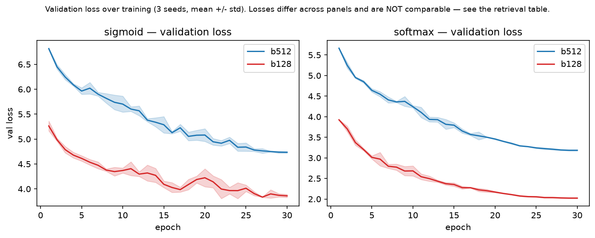

# MicroCLIP

A from-scratch, single-GPU-budget CLIP-style image–text model, built to test one
question rigorously rather than to chase SOTA:

> **Does the SigLIP sigmoid loss keep its reported small-batch advantage over
> softmax (InfoNCE) at small scale?**

Trained on COCO Captions (ResNet-18 image encoder + a small text transformer,
16K BPE tokenizer, shared embedding space), evaluated on COCO 5K retrieval and
zero-shot CIFAR-10/100.


[](https://wandb.ai/umutonuryasar-independent/microclip)

---

## TL;DR — key findings

Across batch sizes **128–512, 3 seeds each** (seeds 42/43/44), on COCO retrieval:

1. **Softmax (InfoNCE) matches or beats sigmoid (SigLIP) at every batch size.**
   The gap is well outside seed noise on the strongest metric (I→T R@10: +2.5 pts
   at batch 512, std ≈ 0.1–0.2).
2. **The gap widens — not shrinks — as batch size drops** (I→T R@10: +2.5 at b512
   → +3.4 at b128), the opposite of the hypothesis.
3. **Sigmoid is also markedly higher-variance at small batch** (b128 seed-std ≈
   0.8–2.0 pts for sigmoid vs ≈ 0.1–0.6 for softmax) — worse *and* less stable.

**This is a non-replication in a small-scale regime, not a refutation of SigLIP.**
SigLIP's advantage is reported at much larger batch/data scales; the batch range
here (128–512) is entirely "small" by CLIP standards and never reaches the regime
where the sigmoid advantage is documented. See [Limitations](#limitations).

---

## What is MicroCLIP

MicroCLIP is a minimal, readable reimplementation of a CLIP-style dual encoder,
written from scratch (encoders, losses, tokenizer, training loop, retrieval and
zero-shot eval) and sized so that a full 30-epoch run fits in a single Colab A100
session. Its purpose is not to be competitive with released CLIP checkpoints but
to make a single controlled comparison — sigmoid vs softmax contrastive loss —
cheap enough to repeat across 3 seeds and 3 batch sizes.

- CLIP-style dual encoder trained from scratch on a single GPU (Colab A100).
- Image encoder: ResNet-18 (from scratch). Text encoder: small transformer over a
  16K BPE tokenizer trained on COCO captions. Both projected to a shared L2-normed
  embedding space with a learnable temperature (`logit_scale`), plus a learnable
  bias (`logit_bias`, init −10) for the SigLIP objective.
- Two contrastive objectives compared head-to-head: **softmax InfoNCE** (CLIP) and
  **sigmoid** (SigLIP).

---

## Setup

```bash
git clone https://github.com/umutonuryasar/microclip.git
cd microclip
python -m venv .venv && source .venv/bin/activate
pip install -e .            # runtime deps declared in pyproject.toml
pip install -e ".[dev]"     # + pytest, for the test suite
```

Requires Python ≥ 3.10 and a CUDA GPU for training (bf16). CPU is fine for
inspecting checkpoints. `requirements.txt` mirrors the same pins for
environments where an editable install is not wanted.

Smoke test (tiny subset, CPU-friendly — verifies the whole train/eval path):

```bash
python scripts/train.py --config configs/smoke_local.yml --limit 64
pytest
```

## Data

COCO Captions: `train2017` images + captions for training, `val2017` for
validation and 5K retrieval. Expected layout is set by `data:` in
`configs/base.yml` (`root: data/coco`):

```
data/coco/
├── train2017/                              # 118K .jpg
├── val2017/                                #   5K .jpg
└── annotations/
    ├── captions_train2017.json
    └── captions_val2017.json
```

Download and unpack:

```bash
mkdir -p data/coco && cd data/coco
wget http://images.cocodataset.org/zips/train2017.zip
wget http://images.cocodataset.org/zips/val2017.zip
wget http://images.cocodataset.org/annotations/annotations_trainval2017.zip
unzip -q train2017.zip && unzip -q val2017.zip && unzip -q annotations_trainval2017.zip
rm ./*.zip && cd ../..
```

The tokenizer artifact (`artifacts/tokenizer/bpe16k.json`, a 16K BPE vocab fit
on the `train2017` captions) is committed, so nothing else is needed for
training or evaluation. To regenerate it from scratch:

```bash
python scripts/train_tokenizer.py --config configs/base.yml
```

CIFAR-10/100 for zero-shot eval is downloaded automatically into `data/cifar/`
on first use.

## Training

```bash
# main configs
python scripts/train.py --config configs/sigmoid_b512.yml
python scripts/train.py --config configs/softmax_b512.yml

# batch-size and ablation variants
python scripts/train.py --config configs/ablations/sigmoid_b128.yml
python scripts/train.py --config configs/ablations/vit_tiny.yml

# override any config field via --set (dotted paths for nested keys)
python scripts/train.py --config configs/sigmoid_b512.yml \
    --set seed=43 run_name=sigmoid_b512_s43 train.lr=1e-4
```

Configs deep-merge onto `configs/base.yml`, so each file under `configs/` only
states its diff. Available ablations: `init_xavier`, `init_he`, `lr_constant`,
`optimizer_sgd`, `vit_tiny`, plus `{sigmoid,softmax}_b{128,256}`.

Runs auto-resume from `runs/<run_name>/last.pt`. Training is seed-deterministic:
model init, data order, caption sampling, and augmentation are all a function of
`(seed, epoch, index)`.

### Colab

`notebooks/01_colab_train.ipynb` is the single harness used to produce every
number in this README: setup, optional smoke test, the seed-matrix training
queue, a completion check, and the seed-grouped evaluation that writes the two
CSVs under `results/`. It keeps working checkpoints on the local SSD (fast) and
mirrors them to `Drive/MyDrive/microclip/runs/<run_name>/` so a disconnect
never loses more than `ckpt_every_steps` (500) steps. The mirror writes to two
fixed slots (`last_a.pt` / `last_b.pt`) in place — no deletes, so nothing lands
in Drive Trash, and a copy torn by preemption leaves the other slot intact.
Budget ≈ 0.5 GB of Drive per run.

## Evaluation

```bash
# COCO 5K retrieval (Recall@1/5/10, both directions)
python scripts/evaluate.py --config configs/softmax_b512.yml \
    --checkpoint runs/softmax_b512/best.pt --task retrieval

# zero-shot CIFAR-10/100 top-1
python scripts/evaluate.py --config configs/softmax_b512.yml \
    --checkpoint runs/softmax_b512/best.pt --task zeroshot
```

`--config` must be the config the checkpoint was trained with (it defines the
architecture the state dict is loaded into); `--limit N` caps the retrieval
corpus for quick checks; `--device` defaults to CUDA when available. Results are
printed as JSON. Evaluation always loads `best.pt` (lowest val-loss checkpoint).
The "Evaluation — seed-grouped" cell of `notebooks/01_colab_train.ipynb` runs
both tasks over every Drive-mirrored run and aggregates across seeds.

---

## Results

### Main comparison — sigmoid vs softmax across batch size

COCO 5K val retrieval, Recall@K in %. `n` = number of seeds; `±` is std across
seeds. Rows with `n=1` are single-seed (indicative only).

| Loss             | Batch | n | T→I R@1     | T→I R@5     | T→I R@10    | I→T R@1     | I→T R@5     | I→T R@10    |
|------------------|:-----:|:-:|-------------|-------------|-------------|-------------|-------------|-------------|
| Sigmoid (SigLIP) |  512  | 3 | 10.0 ± 0.2  | 28.6 ± 0.2  | 40.7 ± 0.2  | 13.4 ± 0.2  | 33.8 ± 0.1  | 45.6 ± 0.1  |
| Sigmoid          |  256  | 1 | 10.1        | 29.1        | 41.7        | 13.3        | 34.6        | 46.7        |
| Sigmoid          |  128  | 3 | 9.5 ± 0.8   | 27.7 ± 1.6  | 39.9 ± 1.8  | 11.7 ± 1.2  | 31.9 ± 1.8  | 44.3 ± 2.0  |
| Softmax (InfoNCE)|  512  | 3 | 10.5 ± 0.1  | 29.6 ± 0.2  | 41.5 ± 0.2  | 14.0 ± 0.4  | 35.9 ± 0.3  | 48.2 ± 0.2  |
| Softmax          |  256  | 1 | 10.8        | 30.8        | 43.4        | 14.3        | 36.6        | 49.4        |
| Softmax          |  128  | 3 | 10.4 ± 0.1  | 30.0 ± 0.4  | 42.5 ± 0.6  | 13.3 ± 0.3  | 35.1 ± 0.6  | 47.7 ± 0.3  |

**Reading the table (honestly):**
- The most robust signal is **I→T R@10**, where softmax leads by ~2.5 pts at b512
  and ~3.4 pts at b128 — roughly 10–20× the seed std. This is the claim to lead with.
- On **T→I R@1 at b128**, the nominal gap (10.4 vs 9.5) overlaps with sigmoid's wide
  seed spread (±0.8); treat that particular cell as suggestive, not conclusive.
- **Batch size has no strong effect in this range** for either loss (b512 ≈ b256 ≈
  b128 within noise). b256 is single-seed, so no "optimal batch" claim is made.

### Training dynamics



Validation loss over 30 epochs (3 seeds, mean ± std). **This figure is a
training-health and variance check, not a performance comparison.** Validation loss
is not comparable across the two panels (different objectives) *or across batch sizes
within a panel*: a smaller batch means a smaller in-batch negative pool, which
mechanically lowers the contrastive loss — lower ≠ better. The objective/batch
comparison is the retrieval table above (fixed eval batch = 64). What this figure
*does* show: (1) all runs converge smoothly, and (2) the visibly wider sigmoid band
at batch 128 — higher seed-to-seed variance at small batch, consistent with the
retrieval results. Live curves (incl. learned temperature `logit_scale`):
[W&B project](https://wandb.ai/umutonuryasar-independent/microclip).

### Ablations

All ablations are single-seed (`n=1`) — indicative, not conclusive. Two baselines
apply, because the recipe ablations were run for 10 epochs and the architecture
ablation for 30:

| Run               | Config                              | Change from base                               | Epochs | T→I R@1 | I→T R@10 |
|-------------------|-------------------------------------|------------------------------------------------|:------:|:-------:|:--------:|
| `base_ep10`       | `configs/base.yml`                  | — (sigmoid, b512, AdamW, cosine, default init) |  10    | 4.9     | 26.8     |
| `abl_init_xavier` | `configs/ablations/init_xavier.yml` | Xavier init                                    |  10    | 5.3     | 30.4     |
| `abl_init_he`     | `configs/ablations/init_he.yml`     | He/Kaiming init                                |  10    | 4.3     | 25.3     |
| `abl_lr_constant` | `configs/ablations/lr_constant.yml` | constant LR (no cosine decay)                  |  10    | 3.9     | 21.2     |
| `abl_sgd`         | `configs/ablations/optimizer_sgd.yml`| SGD (lr = 0.1) instead of AdamW               |  10    | 0.0     | 0.1      |
| `abl_vit_tiny`    | `configs/ablations/vit_tiny.yml`    | ViT-Tiny image encoder (vs ResNet-18)          |  30    | 6.5     | 33.6     |

Run names are the row keys in `results/eval_summary.csv`; in
`results/eval_per_run.csv` the anchor is stored under its seeded name
`base_s42_ep10`, and the main-comparison runs appear both as a bare name
(`sigmoid_b512`, the seed-42 run) and per seed (`sigmoid_b512_s42/43/44`); the
bare row is a duplicate of `_s42` and the summary counts each seed once (`n=3`).

- **Recipe ablations** (init / lr / optimizer) compare against the **10-epoch base
  anchor** (4.9 / 26.8).
- **ViT-Tiny** compares against the **30-epoch ResNet-18** model (sigmoid b512:
  10.0 / 45.6), *not* the 10-epoch anchor.

Takeaways: **LR schedule matters** (cosine 4.9 vs constant 3.9, ~20% relative drop);
**SGD at this LR collapses** to chance (this shows "this untuned SGD config failed,"
not "SGD fails" in general); **initialization is marginal** at this scale (Xavier /
default / He all within ~1 pt); **ViT-Tiny underperforms ResNet-18** from scratch on
this data, as expected for a small ViT without large-scale pretraining.

### Zero-shot CIFAR — inconclusive

Zero-shot CIFAR-10/100 top-1 was measured but is **near chance and high-variance**
(e.g. CIFAR-10 seed-std up to ±7.6). It is reported for completeness only and is
**not** used to draw any conclusion. No "best retrieval ≠ best zero-shot" claim is
made — the CIFAR spread is dominated by noise at this scale.

---

## Reproducibility

- **Seeds:** 42, 43, 44. Main configs are 3-seed; ablations and b256 are single-seed.
- **Determinism:** model init, per-epoch data shuffle, caption sampling, and
  augmentation are all deterministic functions of `(seed, epoch, index)`; training
  resumes bit-for-bit from `last.pt`.
- **Model selection:** `best.pt` = lowest validation-loss checkpoint over 30 epochs.
- **Hardware / precision:** Colab A100, bf16 autocast.
- **Canonical checkpoint:** `softmax_b512` (seed 42) — chosen as a *representative*
  member of a 3-seed group, deliberately **not** the single highest-scoring run
  (`softmax_b256`, `n=1`), to avoid cherry-picking.
- **Commit:** numbers in this README were produced at commit `97fc6d9`
  (`97fc6d9d3eb877be7f7835dc8d34f348fbe26b41`). Re-pin this line if the training
  or eval path changes.
- **Raw numbers:** every table in this README is derived from two tracked files:
  - [`results/eval_per_run.csv`](results/eval_per_run.csv) — one row per run
    (including each individual seed), metrics as fractions in `[0, 1]`.
  - [`results/eval_summary.csv`](results/eval_summary.csv) — runs grouped across
    seeds, metrics as percentages formatted `mean +/- std`; `n` is the seed
    count and the std is `nan` wherever `n = 1`.

  Both are written by the evaluation cell of `notebooks/01_colab_train.ipynb`
  (to `Drive/MyDrive/microclip/`, then copied here). Seeds are grouped by
  stripping the `_s<NN>` suffix from the run folder name.

- **Training curves:** [`results/training_curves.png`](results/training_curves.png)
  is regenerated from [`results/wandb_curves.csv`](results/wandb_curves.csv) by
  [`scripts/plot_wandb_curves.py`](scripts/plot_wandb_curves.py), which pulls the
  finished seed runs from the public
  [W&B project](https://wandb.ai/umutonuryasar-independent/microclip).

---

## Limitations

Stated plainly, because they bound what these results can claim:

- **Small seed count.** `n=3` for main configs; std estimates are coarse. Some
  differences (notably T→I R@1 at b128) fall within seed noise.
- **Single, small scale.** COCO `train2017` (~118K images), from scratch, 30 epochs,
  batch 128–512. **SigLIP's reported small-batch advantage appears at much larger
  batch/data regimes**; this study never reaches that regime, so it does **not**
  refute SigLIP — it reports a non-replication at small scale.
- **b256 and all ablations are single-seed** (`n=1`); treat as indicative.
- **Single retrieval benchmark** (COCO 5K val); no Flickr30k / others.
- **SGD ablation used one untuned LR** (0.1) and diverged; a fair optimizer
  comparison would tune the SGD LR separately.
- **Weight decay is applied to every parameter**, including `logit_scale`,
  `logit_bias`, LayerNorm gains and embeddings (`weight_decay: 0.2`, single
  AdamW param group in `src/microclip/training/trainer.py`). CLIP excludes
  those from decay. Both objectives were trained under the same rule, so the
  comparison stays fair, but the learnable temperature is being pulled toward
  zero throughout training. A no-decay group is the right fix; it is left as
  is so the code matches the reported numbers exactly.
- **Zero-shot CIFAR is noise-dominated** at this scale (see above).
- **Absolute numbers are modest** by design — this is a controlled comparison of
  training objectives on a single-GPU budget, not a SOTA attempt.

---

## Acknowledgements / citation

Built by **Umut Onur Yaşar** as a self-directed capstone following the
CS231n / CS230 course material. All training code, encoders, losses, tokenizer
and eval are written from scratch; the two objectives compared here are:

- Radford et al., *Learning Transferable Visual Models From Natural Language
  Supervision* (CLIP), ICML 2021 — [arXiv:2103.00020](https://arxiv.org/abs/2103.00020)
- Zhai et al., *Sigmoid Loss for Language Image Pre-Training* (SigLIP),
  ICCV 2023 — [arXiv:2303.15343](https://arxiv.org/abs/2303.15343)

Data: COCO Captions (Lin et al., ECCV 2014 / Chen et al. 2015),
[cocodataset.org](https://cocodataset.org). CIFAR-10/100 (Krizhevsky, 2009) for
zero-shot eval.

If you reference this repo:

```bibtex
@software{yasar2026microclip,
  author  = {Ya{\c{s}}ar, Umut Onur},
  title   = {MicroCLIP: a single-GPU study of sigmoid vs softmax contrastive loss},
  year    = {2026},
  url     = {https://github.com/umutonuryasar/microclip}
}
```

Licensed under the MIT License — see [LICENSE](LICENSE).
